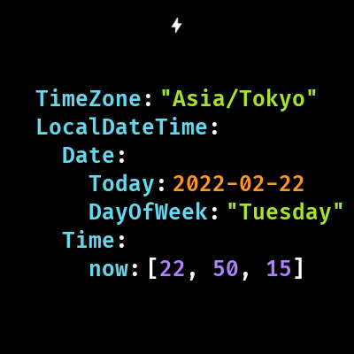

# YAML Watch Face

Watch face just like YAML, made for personal usage.



## WARNING

Yeah, I know, This is the **WORST** code I have ever seen because of verious reasons.  
I think there are better solutions for this type of watch face, so please, don't take this as the example of developing them.

## What is YAML

`YAML Ain't a Markup Language`

YAML is one of the plain-text data format mainly used in config files.

Ex:

```yaml
TimeZone: "Asia/Tokyo"
LocalDateTime:
  Date:
    today: 2020-01-01
    dayOfWeek: "Monday"
  Time:
    now: [00, 00, 00]
```

## Why YAML

Because it's easy to read.

## Why YAML in watch face

~~Because I think that _must be_ a good idea. that's it~~